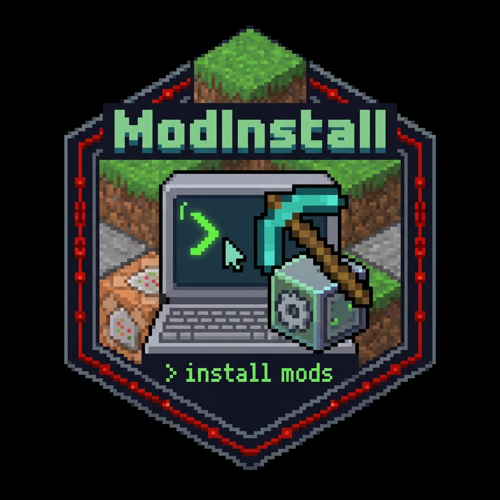

# ModInstall CLI 📦



> **The modern, stylish, and intelligent Minecraft Mod Installer.**  
> Powered by [Modrinth](https://modrinth.com).

**ModInstall** is a command-line tool designed to simplify the life of modders and players. It automatically handles dependencies, filters modpacks, and keeps your mods folder clean.

## ✨ Features

- **🚀 Native & Fast**: Runs as a standalone `.exe` or `.sh`. No Java installation required for the user.
- **🧠 Smart Dependency Resolution**: Automatically installs required dependencies (recursively!).
- **🛡️ Modpack Filtering**: intelligently filters search results to avoid downloading huge modpacks by mistake.
- **🧹 Auto-Clean**: Detects and removes orphaned libraries that are no longer needed (`modinstall clean`).
- **🎨 Beautiful UI**: Rich colors, progress bars, and Unicode/ASCII fallback support.

## 📥 Installation

### Windows
1. Download the latest release.
2. Unzip the file.
3. Double-click on `install.bat`.
4. Done! You can now use `ModInstall` in any terminal.

## 🛠️ Usage

Open your terminal in any Minecraft project folder (where you have a `mods` folder or `gradle.properties`).

### Install a Mod
Installs a mod and all its required dependencies.
```bash
ModInstall install jei
# or multiple mods
ModInstall i create jade waystones
```

### Search via Modrinth
Finds mods matching your query (excluding modpacks).
```bash
ModInstall search optimization
```

### Remove a Mod
Uninstall a mod.
```bash
ModInstall remove waystones
```
*Note: Run `clean` afterwards to remove unused dependencies!*

### Clean Up
Scans your `mods` folder for "orphan" libraries that are no longer used by any mod.
```bash
ModInstall clean
```

### List Mods
Shows all installed mods and their sizes.
```bash
ModInstall list
```

## 🏗️ Build from Source

Requirements: JDK 21+

```bash
# Clone the repository
git clone https://github.com/Rotisami19/modinstall.git

# Build native executable (Windows)
./gradlew nativeImage
```

---
Made with ❤️ by Rotisami19
